# 車両顧客管理システム

顧客・車両・販売・整備・車検予定・入金を、店舗単位でまとめて管理するWebアプリケーションです。
顧客情報を起点に、車両の履歴、見積書・請求書、帳票PDF、入金状況まで一つの流れで確認できます。

## 目次

- [このシステムでできること](#このシステムでできること)
- [業務の流れ](#業務の流れ)
- [詳細機能](#詳細機能)
- [利用開始](#利用開始)
- [開発者向け情報](#開発者向け情報)

## このシステムでできること

| 画面 | 主な機能 |
| --- | --- |
| **ダッシュボード** | 登録車両数、今月の売上、車検期限、未入金請求、入庫・出庫予定をまとめて確認 |
| **顧客・車両** | 顧客情報、複数の所有車両、添付ファイル、画像OCR、販売・整備履歴を管理 |
| **販売** | 販売見積書・請求書の作成、明細入力、税計算、帳票プレビュー、PDF出力 |
| **車検・点検・一般** | 車検・板金・一般整備の受付、作業明細、法定費用、入庫・出庫予定を管理 |
| **点検予定** | 車両に登録した車検満了日をカレンダーと一覧で確認 |
| **入金管理** | 販売・整備請求書の入金履歴、入金済み・未入金額、支払期限を管理 |
| **設定** | 店舗情報、税・端数処理、明細候補、アーカイブ、データ入出力、ユーザー・権限を管理 |

### 組織と権限

ログイン後は、現在選択している組織のデータを操作します。複数の組織に所属している場合は、サイドバーから利用組織を切り替えられます。

| ロール | 主な役割 |
| --- | --- |
| オーナー | 組織の利用開始、ユーザー管理、組織全体の設定管理 |
| 管理者 | 店舗業務、従業員管理、設定・データ操作の管理 |
| 従業員 | 顧客・車両、販売、整備、点検、入金などの日常業務。設定系の操作は組織の権限設定に従う |

## 業務の流れ

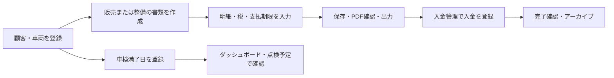

顧客・車両を一度登録すると、販売書類、整備書類、入金管理、車検予定から同じ顧客・車両を参照できます。

## 詳細機能

### 共通画面の使い方

- サイドバーから7つのメイン画面を切り替えます。
- 一覧画面では、検索、絞り込み、並び替え、対象データの選択を行います。
- 編集中のデータを保存せずに移動・新規作成する場合は、確認ダイアログが表示されます。
- 金額は円、日付は画面の表示形式、電話番号・郵便番号・走行距離は入力内容に応じて整形されます。
- `保存` は入力内容をデータへ反映し、`PDFで確認` は帳票を確認し、`PDF保存` または `出力` はファイルとして保存します。
- `アーカイブ` は通常一覧から書類を移動する操作です。完全削除とは異なり、設定画面から復元できます。

<details>
<summary><strong>ダッシュボード</strong> — 店舗の状況と直近の作業を確認する</summary>

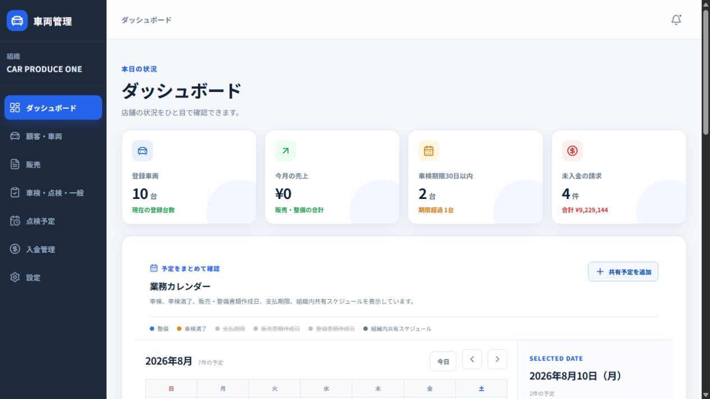

<p align="center"><sub>開発用シードデータによる画面例</sub></p>

#### 表示内容

- 登録車両数
- 今月の売上（販売・整備の合計）
- 車検期限30日以内の車両数と期限超過数
- 未入金の請求件数と合計金額
- 車検、車検満了、販売・整備書類、支払期限、組織内共有スケジュール
- 車検・点検期限、未入金請求、入庫日、出庫日が近い車両・書類

#### 操作

- カレンダーの`今日`、`前月`、`次月`で表示期間を移動します。
- 予定種別のボタンで、カレンダーに表示する予定を切り替えます。
- 日付を選択すると、その日の予定を確認できます。
- `共有予定を追加`から、組織内で共有する予定を登録・編集・削除できます。
- カードや予定を選択すると、顧客・車両、販売、整備、入金管理の対象画面へ移動できます。

</details>

<details>
<summary><strong>顧客・車両</strong> — 顧客情報と所有車両を管理する</summary>

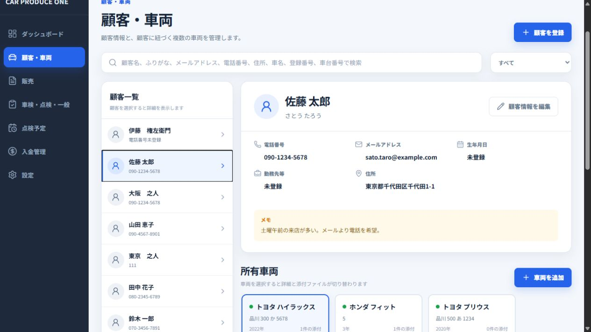

#### 顧客

顧客名、ふりがな、電話番号、メールアドレス、生年月日、勤務先等、郵便番号、住所、メモを登録・編集できます。

検索項目は次のとおりです。

- `すべて`
- `顧客名`
- `ふりがな`
- `メールアドレス`
- `電話番号`
- `住所`
- `車名`
- `登録番号`
- `車台番号`

#### 車両

顧客ごとに複数の車両を登録できます。メーカー、車名、型式、登録番号、車台番号、年式、車検満了日、走行距離、車体色、排気量、ミッション、記録簿、自由項目、備考を管理します。

#### 添付ファイルと履歴

- 車両単位でJPEG・PNG画像、PDFを追加します。
- ファイル名、サイズ、登録日時を確認できます。
- 添付ファイルのプレビュー、ダウンロード、削除を行えます。
- 画像プレビューからOCRを実行し、認識したい領域を選択できます。
- OCRの結果は必ず原本と照合してから利用してください。
- 車両に紐づく販売・整備書類を車両履歴として確認できます。

</details>

<details>
<summary><strong>販売</strong> — 販売見積書・請求書を作成する</summary>

<table>
  <tr>
    <td>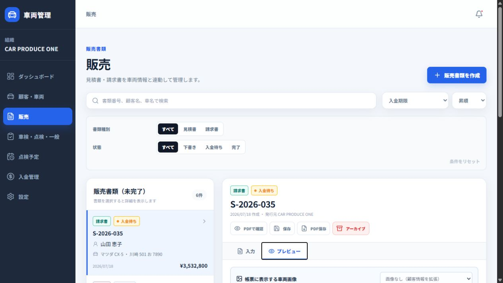</td>
    <td>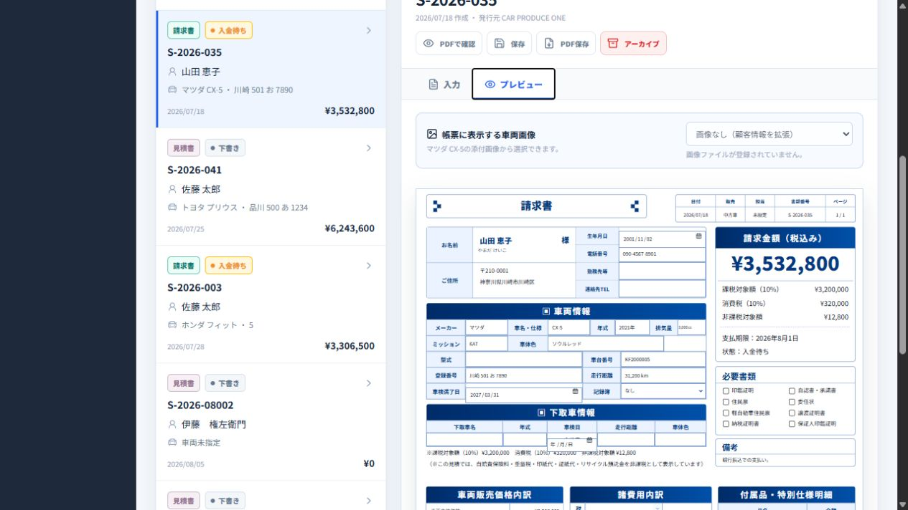</td>
  </tr>
  <tr>
    <td align="center">販売書類の一覧・絞り込み</td>
    <td align="center">販売帳票のプレビュー</td>
  </tr>
</table>

#### 書類作成

`販売書類を作成`から、書類種別、顧客、対象車両を選んで`入力を開始`します。既存の顧客・車両だけでなく、新規顧客・新規車両を作成しながら開始できます。

#### 一覧と状態

- 書類番号、顧客名、車名で検索します。
- 書類種別を`すべて`、`見積書`、`請求書`で絞り込みます。
- 状態を`すべて`、`下書き`、`入金待ち`、`完了`で絞り込みます。
- 作成日時、入金期限、顧客名、車両名で並び替えます。
- 未完了書類と、作成月ごとの完了書類を確認できます。

#### 入力・計算・帳票

- 書類種別、状態、顧客、対象車両、書類日付、支払期限を入力します。
- 車両本体価格、値引等、工賃、法定費用、手続代行費用、実費・預託金、下取車、付属品・特別仕様などの明細を入力します。
- 数量、単位、単価、技術料・他、摘要、課税区分を明細ごとに管理します。
- 課税区分は`課税`、`非課税`、`対象外`です。
- 税率、課税対象額、消費税、非課税対象額、合計を帳票プレビューで確認します。
- `入力`と`プレビュー`を切り替え、帳票の内容を確認します。
- `PDFで確認`、`保存`、`PDF保存`、`アーカイブ`を使い分けます。

</details>

<details>
<summary><strong>車検・点検・一般</strong> — 整備受付と作業明細を管理する</summary>

<table>
  <tr>
    <td>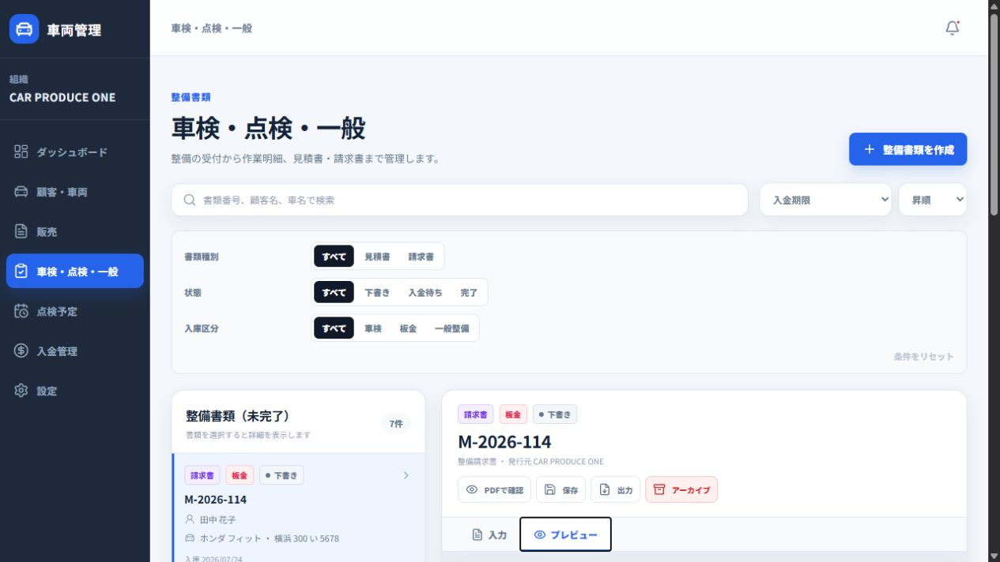</td>
    <td>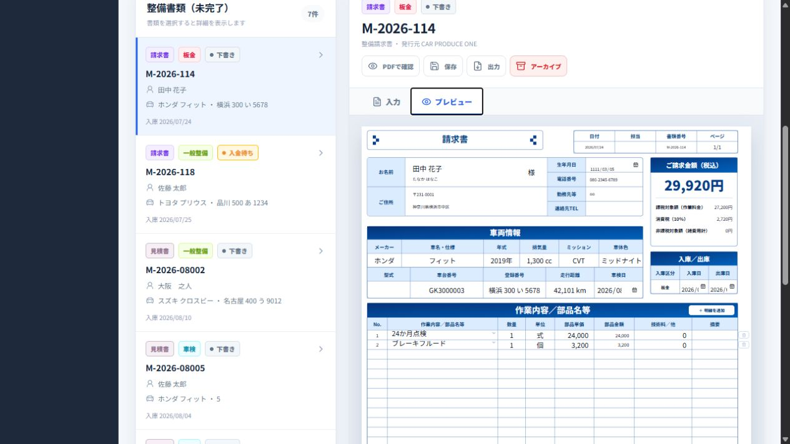</td>
  </tr>
  <tr>
    <td align="center">整備書類の一覧・絞り込み</td>
    <td align="center">整備帳票のプレビュー</td>
  </tr>
</table>

#### 書類作成

`整備書類を作成`から、整備見積書・整備請求書、入庫区分、顧客、車両を選んで`入力を開始`します。

入庫区分は次の3種類です。

- `車検`
- `板金`
- `一般整備`

#### 一覧と入力

- 書類番号、顧客名、車名で検索します。
- 書類種別、状態、入庫区分で絞り込みます。
- 状態は`下書き`、`入金待ち`、`完了`です。
- 書類日付、入庫日、出庫予定日、支払期限を入力します。
- 作業・部品、内容、数量、単位、部品単価、技術料、摘要を入力します。
- 自賠責、重量税、印紙代、リサイクル料金などの法定費用を管理します。
- 走行距離や顧客・車両情報を帳票上で更新する場合は、保存前に内容を確認します。

`入力`と`プレビュー`を切り替え、`PDFで確認`、`保存`、`出力`、`アーカイブ`を実行できます。

</details>

<details>
<summary><strong>点検予定</strong> — 車検満了日を確認する</summary>

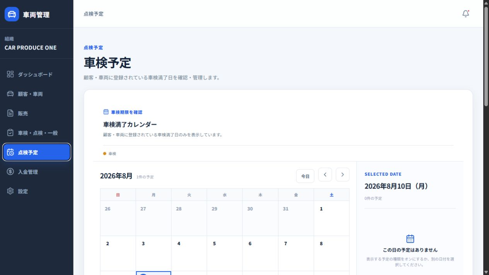

- 顧客・車両に登録された車検満了日をカレンダーで確認します。
- `今日`、`前月`、`次月`でカレンダーを移動します。
- 満了年・満了月で絞り込みます。
- 顧客名、車名、登録番号、車台番号で検索します。
- 車検カードには顧客名、車両名、車検満了日、登録番号、車台番号を表示します。
- 車両カードから顧客・車両画面へ移動し、車検満了日を更新できます。

</details>

<details>
<summary><strong>入金管理</strong> — 請求ごとの入金状況を管理する</summary>

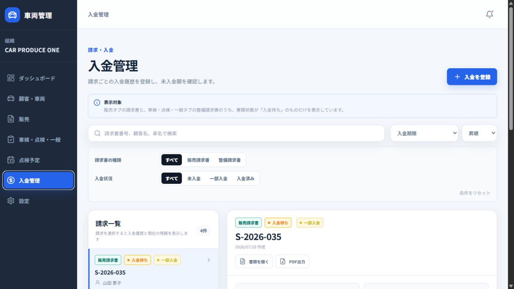

販売請求書・整備請求書のうち、状態が`入金待ち`の書類を表示します。

- 請求書番号、顧客名、車名で検索します。
- 請求書の種類を`販売請求書`、`整備請求書`で絞り込みます。
- 入金状況を`未入金`、`一部入金`、`入金済み`で絞り込みます。
- 請求金額、入金済み金額、未入金額、支払期限を確認します。
- 入金額、入金日、入金方法、メモを登録します。
- 入金方法は`現金`、`銀行振込`、`クレジットカード`、`その他`です。
- 入金履歴は新しい順に表示され、編集・削除できます。
- 履歴を削除すると、入金済み金額と未入金額が再計算されます。
- 対象書類を開く、PDFを出力する操作も行えます。

</details>

### 設定

<details>
<summary><strong>設定</strong> — 店舗・帳票・データ・権限を管理する</summary>

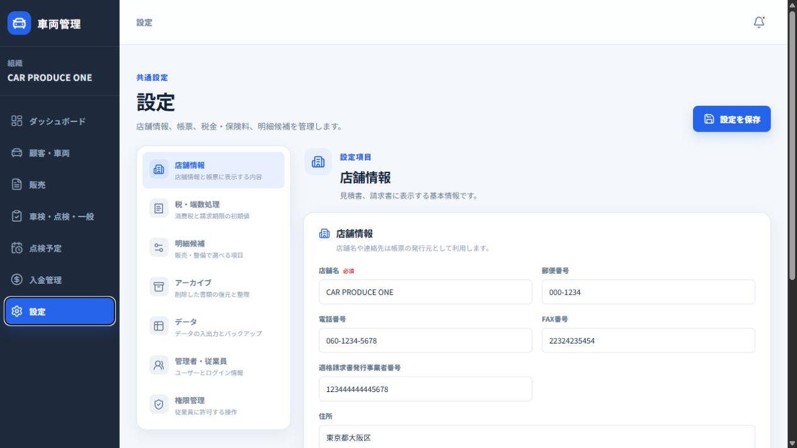

設定画面には、利用者の権限に応じて次のサブタブが表示されます。

#### 店舗情報

帳票の発行元として利用する店舗名、郵便番号、住所、電話番号、FAX番号、適格請求書発行事業者番号、ロゴ画像を設定します。請求書に表示する振込口座・口座名義も管理できます。

#### 税・端数処理

消費税率、端数処理、販売書類の支払期限の初期日数を設定します。端数処理は`切り捨て`と`四捨五入`から選択できます。

#### 明細候補

販売書類の候補を次の3グループで管理します。

- 車両販売価格内訳
- 諸費用内訳
- 付属品・特別仕様明細

整備書類では、整備作業・部品候補を追加・名称変更・削除できます。登録した候補は、販売・整備書類の入力欄から選択できます。

#### アーカイブ

販売・整備画面でアーカイブした書類を検索・確認します。

- 通常一覧への復元
- 永久保存の設定・解除
- 保管期間の変更
- 完全削除

永久保存していない書類は、設定した保管期間を過ぎると自動削除の対象になります。完全削除は復元できないため、対象と確認ダイアログを確認してから実行します。

#### データ

##### CSV出力

顧客一覧、車両一覧、販売書類、整備書類、入金管理をUTF-8 CSVとして出力できます。

##### CSVインポート・移行

1. 取込対象を選択します。
2. CSVファイルを選択します。
3. `内容を確認`でプレビューとエラー行を確認します。
4. 問題がなければ`この内容を取り込む`を実行します。

対象は顧客一覧、車両一覧、販売書類、整備書類、入金管理です。ファイルは5MB以内、5,000行以内で使用します。取込後は追加・更新・スキップ件数を確認します。

##### バックアップ・復元

D1の組織データと、B2に保存された車両添付ファイルをバックアップします。オンライン（B2）、PC、または両方への手動保存、メモ、保管期間、永久保存、復元を利用できます。

定期バックアップはオンライン（B2）のみ利用でき、頻度は`毎日`または`毎週`です。PCの定期バックアップは実装されていません。復元前には安全バックアップを作成し、復元対象と復元後の件数を確認します。

#### 管理者・従業員

自分の表示名、メールアドレス＋パスワード、Googleログインを管理します。メール確認、パスワード変更、Googleログインの連携・解除もここから行います。

管理者・オーナーは、組織に所属する従業員の追加、ロール変更、利用停止、組織からの削除を行えます。従業員を追加したときに表示される初期パスワードは、画面を閉じると再表示できないため、安全な方法で本人へ伝えてください。

#### 権限管理

管理可能な利用者にのみ表示されます。従業員に対して、次の操作を許可するか設定できます。

- CSV出力
- 店舗情報の変更
- 税率情報の変更
- バックアップの作成・PC出力・インポート復元・B2復元
- バックアップの削除・永久保存・保持期限変更
- アーカイブの永久保存・保持期限変更

変更後は画面上部の`設定を保存`で反映します。

</details>

## 利用開始

<details>
<summary><strong>初回セットアップとログイン</strong> — 本番環境で利用を開始する</summary>

1. ログイン画面でメールアドレス＋パスワード、またはGoogleアカウントで認証します。
2. 初回利用時は、組織名・店舗名と管理者用のセットアップキーを入力します。
3. 最初の管理者として組織を作成します。
4. `設定`の`店舗情報`で帳票に表示する店舗情報を登録します。
5. `管理者・従業員`から従業員を追加し、初期パスワードを安全に伝えます。
6. 従業員は初回ログイン時に自分専用のパスワードへ変更します。

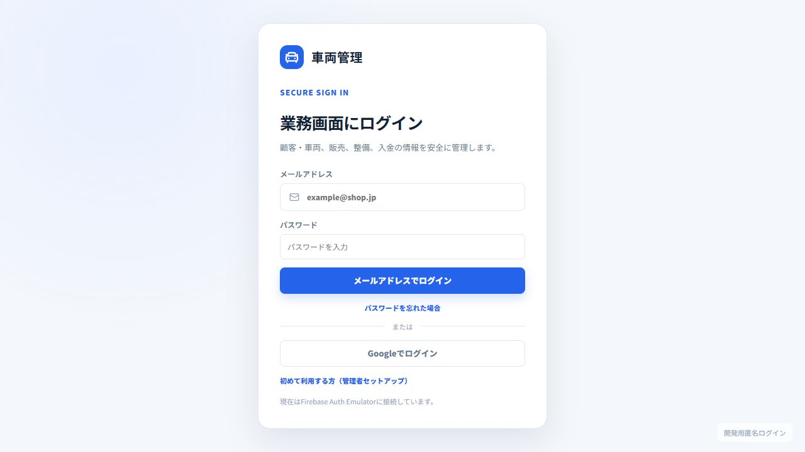

本番のセットアップキー、パスワード、APIキー、サービスアカウント、B2キーなどの秘密情報は、READMEやリポジトリへ記載しません。

</details>

## 開発者向け情報

<details>
<summary><strong>ローカル開発環境を起動する</strong></summary>

ルートディレクトリで次を実行します。

```powershell
pnpm dev
```

次の3つが同時に起動します。

- Firebase Auth Emulator（`http://127.0.0.1:9099`）
- Cloudflare Workers API（`http://127.0.0.1:8787`）
- Vite Web（`http://localhost:5173`）

API起動時に開発用ローカルD1の未適用マイグレーションを自動適用します。手動で適用する場合は次を実行します。

```powershell
pnpm migrate:local
```

個別に起動する場合は次を使用します。

```powershell
pnpm dev:auth
pnpm dev:api
pnpm dev:web
```

詳細は [ローカル開発環境](docs/local-development.md) と [開発・本番環境の分離](docs/environment-separation.md) を参照してください。

</details>

<details>
<summary><strong>環境変数を設定する</strong></summary>

環境変数の実ファイルはGitへコミットしません。値はこのREADMEやソースコードへ記載せず、安全な保管場所から設定します。

### Web

開発用は`apps/web/.env.development`、本番用は`apps/web/.env.production`です。

```text
VITE_APP_ENV
VITE_FIREBASE_API_KEY
VITE_FIREBASE_AUTH_DOMAIN
VITE_FIREBASE_PROJECT_ID
VITE_FIREBASE_STORAGE_BUCKET
VITE_FIREBASE_MESSAGING_SENDER_ID
VITE_FIREBASE_APP_ID
VITE_FIREBASE_AUTH_EMULATOR_URL（開発用のみ）
VITE_API_BASE_URL
```

### API

開発用は`apps/api/.dev.vars.development`、本番構成のローカル確認用は`apps/api/.dev.vars.production`です。

```text
APP_ENV
DATA_ENV
FIREBASE_PROJECT_ID
FIREBASE_AUTH_EMULATOR
FIREBASE_WEB_API_KEY
FIREBASE_ADMIN_SERVICE_ACCOUNT_JSON
INITIAL_SETUP_KEY
CORS_ORIGIN
B2_ENDPOINT
B2_REGION
B2_BUCKET
B2_KEY_ID
B2_APPLICATION_KEY
```

`.dev.vars.production`はローカル確認用です。実際に本番Workerへ設定するSecretはCloudflare/Wrangler側で管理します。

</details>

<details>
<summary><strong>本番用コマンド</strong></summary>

本番操作は、開発用の`pnpm dev`とは別の明示的なコマンドです。対象環境と実行内容を確認してから使用してください。

```powershell
# 本番用Webをビルド
pnpm build:production

# 本番D1へマイグレーションを適用
pnpm migrate:production

# 本番Workerへデプロイ
pnpm deploy:production
```

</details>

### 関連ドキュメント

- [ローカル開発環境](docs/local-development.md)
- [開発・本番環境の分離](docs/environment-separation.md)
